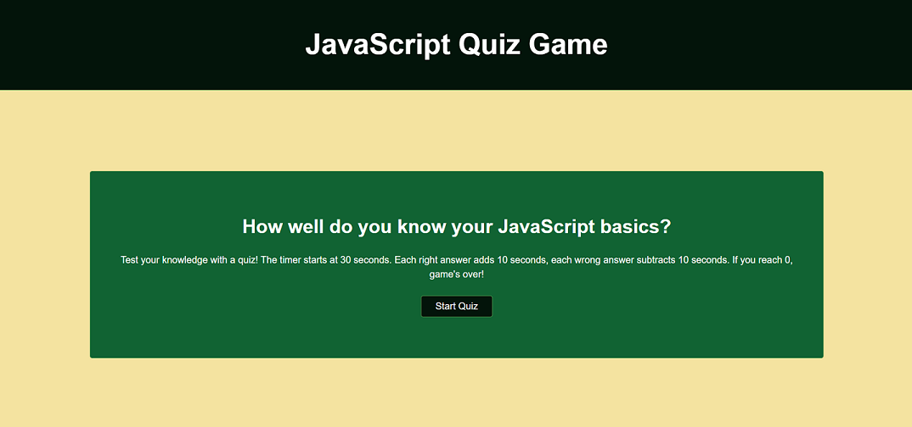

# JavaScript Coding Quiz

## Description

This is a timed coding quiz with multiple-choice questions. This app runs in the browser and features dynamically updated HTML and CSS powered by JavaScript code. Test your knowledge of Javascript fundamentals and save your scores to see how you improve! Saving is done with local storage.

## Table of Contents

* [Mock-Up](#mock-up)
* [Installation](#installation)
* [Usage](#usage)
* [Known Bugs and Other Issues](#known-bugs)
* [Credits](#credits)

## Mock-Up

The following image shows the web application's appearance and functionality:

## Installation

To install this application, you can clone the repository from GitHub. You can also view the deployed application [here](https://eabaynes.github.io/practice-quiz/).

## Usage

To use this application, launch the index.html file in your browser. You will be presented with a start button. Click the start button to begin the quiz. You will be presented with a series of questions. You will have 30 seconds initially, and time will be added or subtracted based on if your answer is correct or incorrect. When all questions are answered or the timer reaches 0, the game is over. You will be presented with your final score and asked to enter your initials.

## Known Bugs and Other Issues

Currently, there are a few minor bugs in this application.
- The timer lags slightly when adjusting the score based on if the answer is correct or incorrect.
- The restart button will alter the css of the intro page.
- Currently, submitting your high score will not display it to the high scores, only save it to local storage.

## Credits

This application was created by [Elliot Baynes](https://github.com/eabaynes)